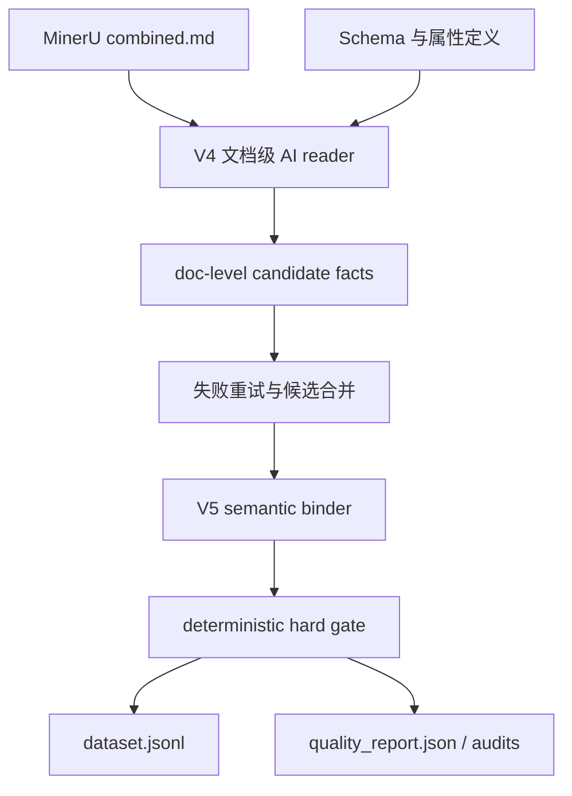

# 技术解决方案报告

## 1. 任务理解

材料赛题要求从 MinerU 解析后的材料文献中识别材料实体、归一化实体名称，并抽取与材料绑定的关键属性，包括制备工艺、性能指标和热/电化学参数。难点在于长文档、图表证据、少样本泛化、同一材料跨章节别名和属性分散。

本方案把任务拆成“论文阅读发现事实”和“语义绑定确认事实”两层：第一层尽可能发现候选，第二层只保留能被原文证据支持的材料-属性-数值记录。

## 2. 总体架构

## 3. 关键技术

### 3.1 Agentic 论文阅读

V4 不是只靠规则扫数值，而是让模型在候选证据窗口和论文上下文中识别材料实体、属性、数值、单位、条件和证据。它适合应对材料命名复杂、信息分散和图表行表达不规则的问题。

### 3.2 语义绑定层

V5 对每条候选重新判断 source property label 是否与目标属性一致、measured entity 是否就是目标材料、evidence quote 是否直接支持材料-属性-数值、单位是否属于目标属性、综述和书章是否应剔除。

### 3.3 确定性 hard gate

代码层只做不可辩论的约束：JSONL 可解析、字段齐全、单位合法、quote 可在 `combined.md` 中对齐、材料绑定和证据绑定没有显式 problem。这样避免把正则当主抽取器，同时给最终结果提供稳定底线。

## 4. 工程化实现

- 并发调用：V4/V5 均支持 worker 并发。
- 失败隔离：单文档失败不会阻塞全局；本次 doc41 首轮 JSON 失败后单独重试。
- 可追溯输出：保留 doc-level 候选、V5 审计、review 原因和最终数据。
- 可部署 Demo：`demo/material_api.py` 提供检索和过滤接口。

## 5. 本次结果

- V4 文档状态：{'completed': 180, 'failed': 1}，失败文档已重试。
- V5 输入：1421 条。
- 最终输出：688 条。
- 丢弃/review：733 条。
- hard gate 错误：0。
- quote 对齐：{'exact': 678, 'whitespace_compact': 10}。
- 属性分布：{'process_temperature': 393, 'thermal_transition': 46, 'discharge_capacity': 117, 'ionic_conductivity': 77, 'adhesion_strength': 55}。

## 6. 创新点

1. AI 负责语义阅读，代码负责确定性证据约束，避免纯正则抽取的脆弱性。
2. 候选发现与最终清洗分层，允许高召回探索和高精度提交并存。
3. 针对材料任务加入 measured entity、source property label、target property match 等绑定字段，降低“数值对但对象错”的风险。
4. 支持专利与论文两类来源，并显式剔除 review/book chapter 结果。

## 7. 应用价值

该系统可以作为材料知识库构建的第一层事实抽取器，用于快速沉淀制备温度、电化学容量、离子电导、黏附强度和热转变温度等关键数据，服务材料筛选、工艺优化和文献检索增强。
